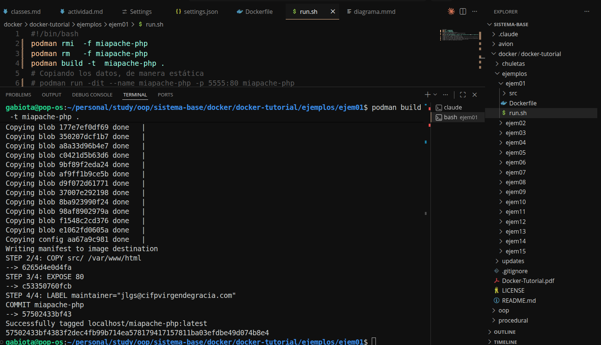
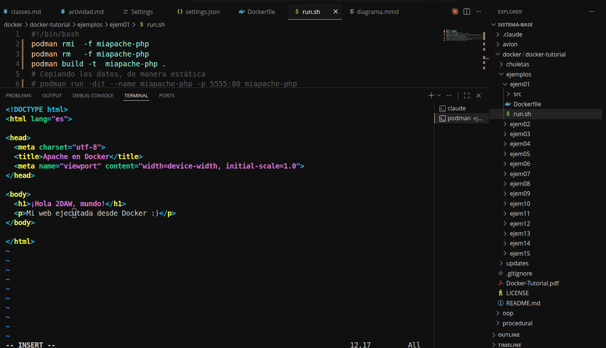

# Ejemplo 1 — Apache + PHP en contenedor

**Materia:** DAD
**Fecha:** 2026-05-05
**Repositorio base:** https://github.com/joseluisgs/docker-tutorial/tree/master (carpeta `ejemplos/ejem01`)

> Nota: este ejercicio se realizó con **Podman** (no con Docker). Podman es compatible con la sintaxis de Dockerfile y los registros de imágenes, así que todos los comandos `docker ...` se reemplazan por `podman ...` sin cambios adicionales.

---

## Objetivo

Construir una imagen de un servidor Apache con PHP, levantar el contenedor, instalar un editor de texto (vim) dentro del contenedor en ejecución, y editar `index.html` agregando nombre, fecha y materia.

---

## Errores encontrados y soluciones

Durante el desarrollo del ejercicio aparecieron **dos errores** en el `Dockerfile` original.

### Error 1 — `MAINTAINER` con comillas tipográficas

El `Dockerfile` original incluía:

```dockerfile
MAINTAINER JL Gonzalez "jlgs@cifpvirgendegracia.com"
```

Dos problemas:

1. La instrucción `MAINTAINER` está **deprecada** desde Docker 1.13. La forma moderna es usar una etiqueta `LABEL`.
2. Las comillas eran tipográficas (`"..."`) en lugar de comillas rectas (`"..."`), lo que puede romper el parseo.

**Solución aplicada:** reemplazar la línea por:

```dockerfile
LABEL maintainer="jlgs@cifpvirgendegracia.com"
```

### Error 2 — Repositorios APT inaccesibles (Debian stretch EOL)

Al intentar instalar `vim` dentro del contenedor con:

```bash
apt-get update
apt-get install -y vim
```

`apt-get update` devolvió múltiples errores `404 Not Found`:

```
Err:9  http://security.debian.org/debian-security stretch/updates/main amd64 Packages
       404  Not Found
Err:10 http://deb.debian.org/debian stretch/main amd64 Packages
       404  Not Found
Err:11 http://deb.debian.org/debian stretch-updates/main amd64 Packages
       404  Not Found
E: Failed to fetch http://deb.debian.org/debian/dists/stretch/main/binary-amd64/Packages
E: Some index files failed to download. They have been ignored, or old ones used instead.
```

Y luego `apt-get install -y vim` falló con:

```
E: Unable to locate package vim
```

#### Causa

La imagen base original (`php:7.0-apache`) está construida sobre **Debian 9 "stretch"**, que llegó al fin de su ciclo de vida (**End Of Life**) en julio de 2022. Al estar EOL, los paquetes ya no se sirven desde los mirrors normales de Debian — se mueven al repositorio de archivo `archive.debian.org`. Por eso todos los `Packages` devuelven 404: las URLs siguen existiendo pero el contenido fue retirado.

#### Soluciones posibles

Se evaluaron dos caminos:

1. **Workaround:** reescribir `/etc/apt/sources.list` dentro del contenedor para apuntar a `archive.debian.org` y desactivar la verificación de fechas (`-o Acquire::Check-Valid-Until=false`). Funciona, pero es frágil y mantiene una imagen base sin soporte de seguridad.

2. **Solución de raíz:** actualizar la imagen base a una versión vigente de PHP, basada en una versión de Debian que aún reciba soporte.

#### Decisión: actualizar la imagen base (KISS)

Se eligió la opción 2 por ser más **simple, mantenible y segura**. El cambio en el `Dockerfile` fue una sola línea:

```diff
- FROM php:7.0-apache
+ FROM php:8.2-apache
```

`php:8.2-apache` está basada en **Debian 12 "bookworm"**, que recibe actualizaciones de seguridad. Tras este cambio, `apt-get update && apt-get install -y vim` funcionó sin modificaciones.

Razonamiento: anclar un Dockerfile a un tag muy antiguo (`php:7.0`) lo ata a una versión de Debian cuyos repositorios eventualmente se retiran. La práctica recomendada es usar imágenes base con soporte vigente.

---

## Dockerfile final

```dockerfile
# Imagen a usar
FROM php:8.2-apache
# copiamos todos los ficheros en el directorio en cuestion
COPY src/ /var/www/html
# Exponemos el puerto 80
EXPOSE 80
# Quien lo ha realizado
LABEL maintainer="jlgs@cifpvirgendegracia.com"
```

---

## Pasos ejecutados

```bash
# 1. Construir la imagen
cd ejemplos/ejem01
podman build -t miapache-php .

# 2. Levantar el contenedor en segundo plano, mapeando el puerto 80 → 8080
podman run -d --name miapache-php -p 8080:80 miapache-php

# 3. Verificar que el sitio responde
curl http://localhost:8080

# 4. Entrar al shell del contenedor en ejecución ("editar online")
podman exec -it miapache-php bash

#    --- dentro del contenedor ---
apt-get update
apt-get install -y vim
vi /var/www/html/index.html
#    presionar i para insertar, escribir nombre + fecha + materia,
#    luego ESC, :wq para guardar y salir
exit

# 5. Verificar el cambio
curl http://localhost:8080
```

---

## Capturas de pantalla

> Las imágenes están en la carpeta `screenshots/`.

### 1. Construcción de la imagen


### 2. Contenedor en ejecución y sitio respondiendo


### 3. Error de `apt-get` con la imagen base antigua


### 4. Instalación de vim tras actualizar la imagen base


### 5. Edición de `index.html` con vi


### 6. Resultado final en el navegador

